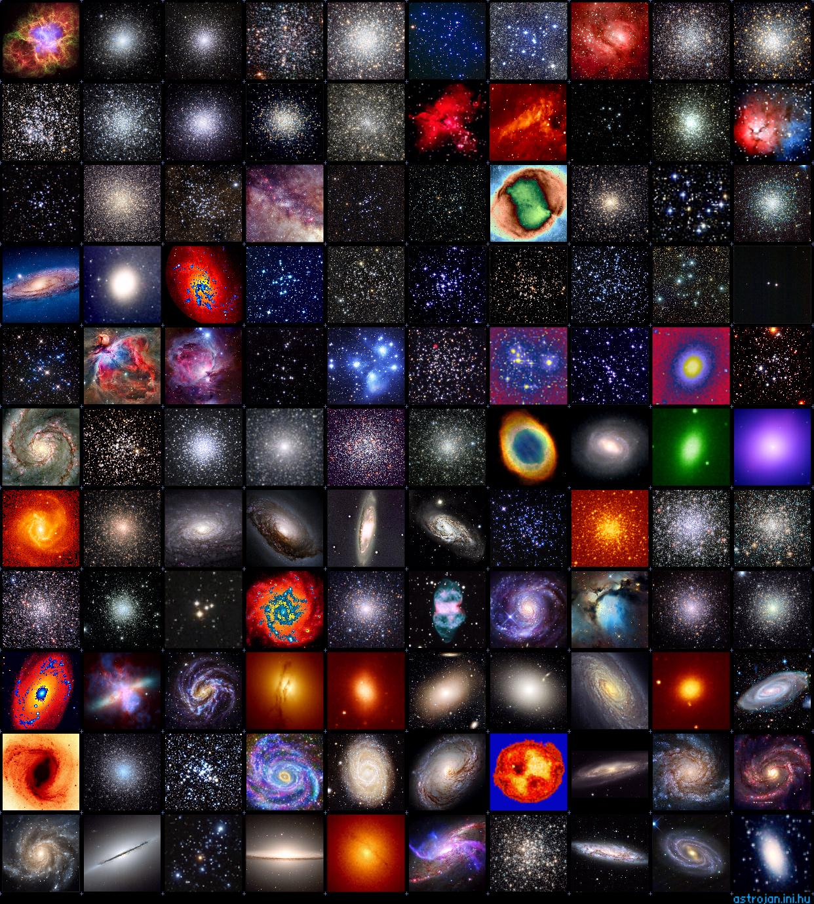

# Messier objects

O objetivo desta API e listar os objetos do catálogo Messier, iniciado pelo astrônomo Charles Messierno século XVIII e revisado ao longo dos anos, inclui alguns dos objetos astronômicos mais fascinantes que podem ser observados no Hemisfério Norte da Terra. Entre eles estão objetos do céu profundo que podem ser vistos com detalhes impressionantes usando telescópios maiores, mas também são brilhantes o suficiente para serem vistos por um pequeno telescópio.

<p align="center">
  
 </p>

   
  <h3 align="center"> Virtual map of messier objects API</h3>

  <h4 align="center">
     <br />
    <a href="https://github.com/othneildrew/Best-README-Template"><strong>Explore the docs »</strong></a>
    <br />
    <br />
     ·
    <a href="">Reportar Bug</a>
    ·
    <a href="">Soliciatar recurso</a>
  </p>
</div>

 <h3 align="center">
 
<p align="center">
 
<p align="center">
Os dados capturados para esta listagem esta no site da <a href="https://www.nasa.gov/subject/14467/hubbles-messier-catalog/" target="_blank">NASA</a> visando dados pertinentes
  <a href="https://github.com/Mario23junior/Galaxy-API/runs/7950437483?check_suite_focus=true"></a>
  
<a href="https://en.wikipedia.org/wiki/Representational_state_transfer"></a>
</p>

## 🔩 Instruções para uso local

Clone o repositório:

Git:
```
$ git clone https://github.com/Mario23junior/Galaxy-API.git
```
Ou baixe um ZIP de main [manualmente](https://github.com/Mario23junior/Galaxy-API/archive/refs/heads/main.zip) e expanda o conteúdo em algum lugar em seu sistema

## 📋  Pré-requisitos

* Tenha um JDK Java instalado
* Tenha o Maven instalado e disponível em seu PATH ou IDE
* Tenha o google-chorme instalado
* Tenha um iterador de APIs para testes HTTP ex: [Postman](https://www.postman.com/downloads/), [Insonia](https://insomnia.rest/download)

## ⚛️ CLI

Abra o terminal de comando e verifique se todos os compartimentos necessários estão em seu devido path e atualizados:

```
$ java -versão
# ^ deve ser pelo menos *8
$ mvn -v
# ^ deve ser pelo menos 3.0.0
```
## ☑️ Verifique a instalação

Você pode verificar as compilações do projeto corretamente no seu IDE ou por linha de comando

Finalmente, verifique se `mvn install` foi bem sucedido.
